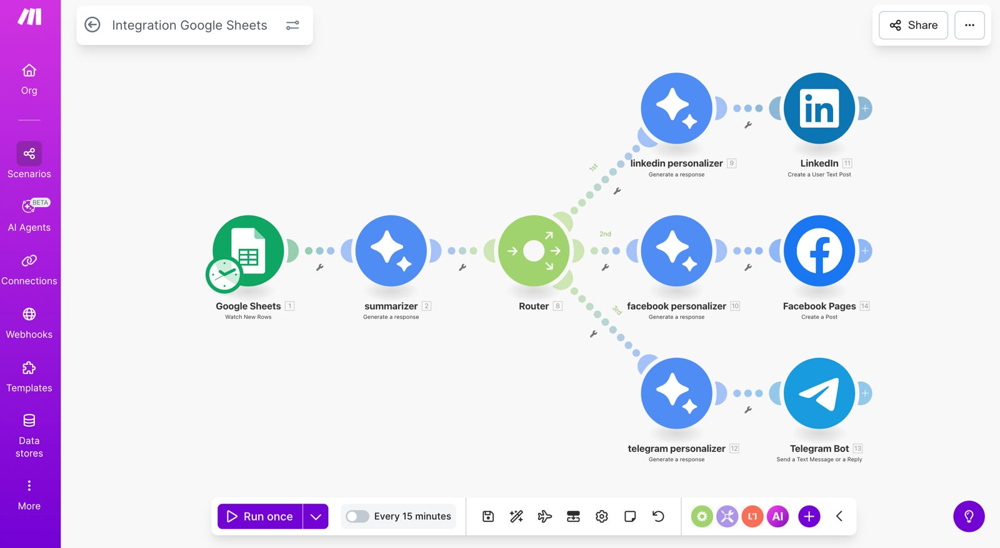
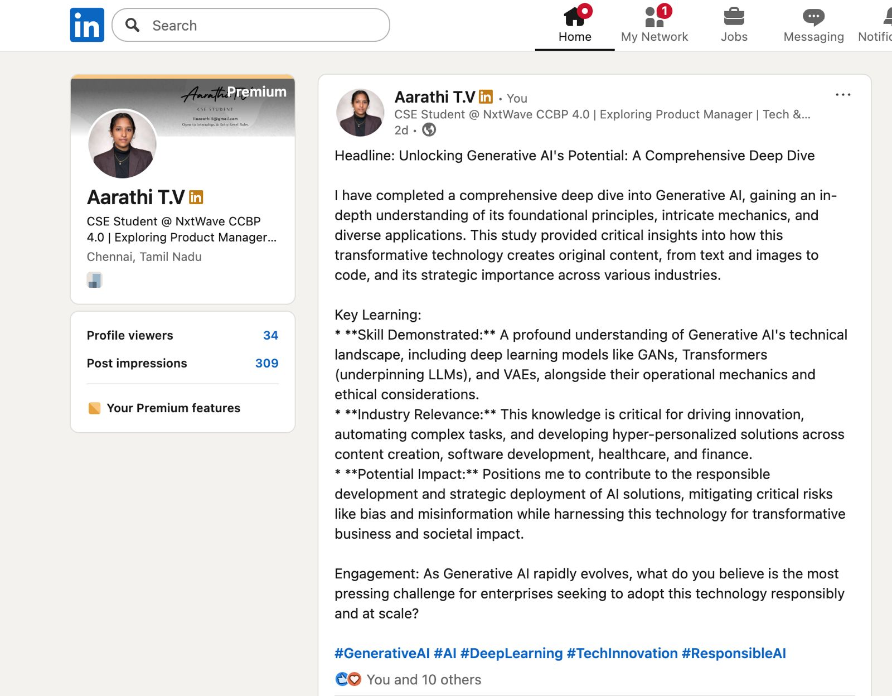
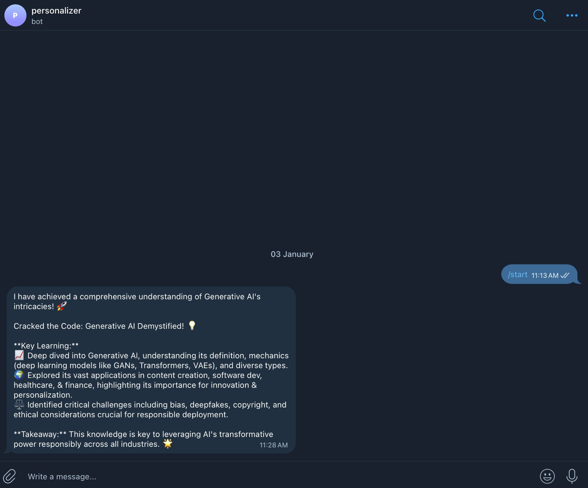

## AI Content Automation Workflow – Multi-Platform Publishing System
## 📌 Problem Statement

Managing content across multiple platforms like LinkedIn, Facebook, and Telegram manually is repetitive, time-consuming, and inconsistent in tone and formatting.

Content creators and professionals often struggle to:

Maintain platform-specific personalization

Post consistently

Avoid duplication of effort

There is a need for an automated, intelligent system that adapts content to each platform while maintaining efficiency.

## 💡 Solution

This project is an AI-powered workflow automation system that:

Fetches content from a centralized Google Sheet

Uses AI to summarize and structure content

Personalizes the output for different platforms

Automatically publishes posts to LinkedIn, Facebook, and Telegram

Built using workflow automation tools and AI integration.

## 🔄 System Architecture

Google Sheets (Content Source)
⬇
AI Summarizer Module
⬇
Router (Platform-based branching)
⬇
Platform Personalizer (LinkedIn / Facebook / Telegram)
⬇
Auto Publishing

## ⚙️ Tools & Technologies Used

Make.com (Workflow Automation)

Google Sheets (Content Database)

AI Text Generation Modules

LinkedIn API Integration

Facebook Pages Integration

Telegram Bot API

## 🚀 Key Features

Centralized content management

Platform-specific tone adjustment

Automated publishing

Reduced manual posting effort

Scalable multi-platform workflow

## 🎯 Impact

Saves time in content distribution

Ensures consistent branding

Reduces repetitive manual work

Demonstrates AI-driven automation capability

## 🧠 What I Learned

Designing logical workflow architecture

Using routers and branching in automation tools

Platform behavior differences

AI-assisted content structuring

Practical API integrations

## 📈 Future Improvements

Analytics tracking integration

Auto-scheduling optimization

Performance-based content variation

CRM integration

## 📸 Implementation Screenshots
Below are real execution screenshots of the automation workflow:

### Workflow Architecture

### Platform Personalization Output (LinkedIn)

### Telegram Automation Output

